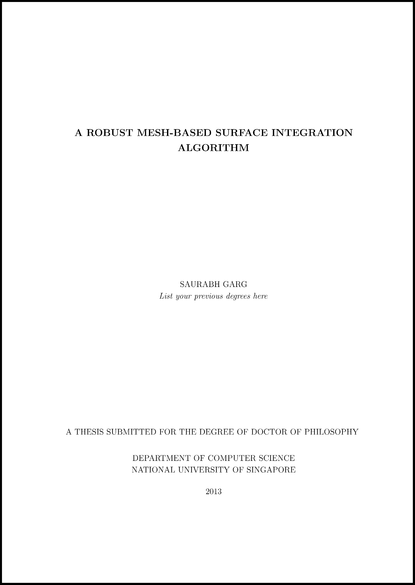
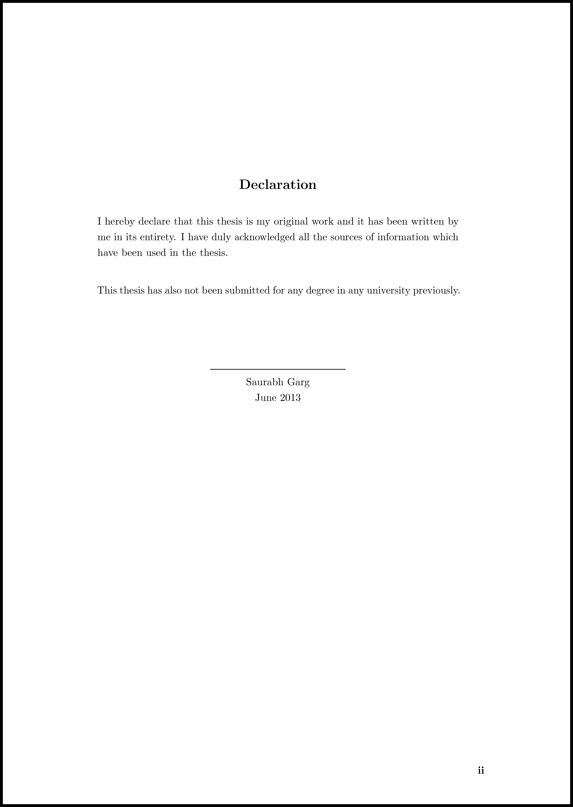
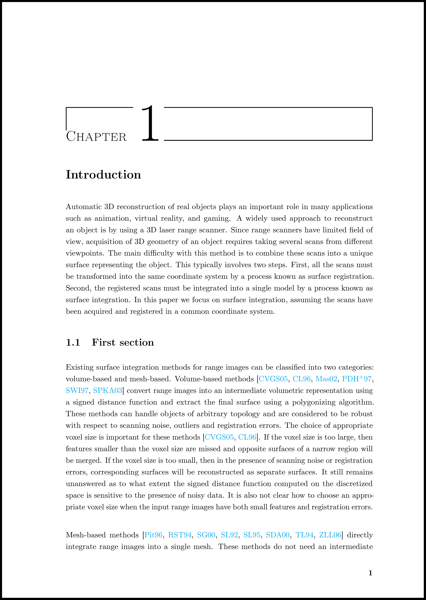
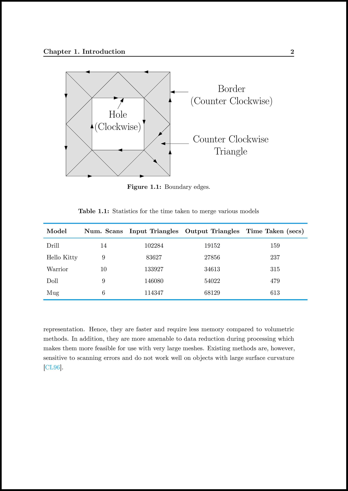

# SPhDThesis #

SPhDThesis is a latex document class for writing PhD thesis. It is based on the "NUS Guidelines on Format of Research Thesis Submitted For Examination" (http://www.nus.edu.sg/registrar/event/gd-thesisexam.html).

SPhDThesis document class can only be used with pdflatex and it doesn't work with latex. This means that all figures should be either in pdf, png, or jpg format. If you have eps figures then they must be converted to pdf.

## Files ##
1. SPhDThesis.cls is the document class. You need to copy this to the same folder as the tex file which includes it.
2. SPhDThesis.pdf is the manual of the document class. It describes how to use the document class and provides some hints on how to customize it. 
3. Example folder contain a complete example of thesis using SPhDThesis document class. It illustrate the main file (thesis.tex), and how to format figures (figure.tex), tables (table.tex), and algorithms (algorithm.tex). thesis.pdf shows how a thesis using SPhDThesis looks like.

## Screenshots ##
Here are some screenshots of the thesis written using SPhDThesis document class.

<strong>Title Page</strong>

 

<strong>Declaration</strong>

 

<strong>Table of Contents</strong>

 

<strong>Chapter Title</strong>

 

<strong>Chapter Header</strong>

