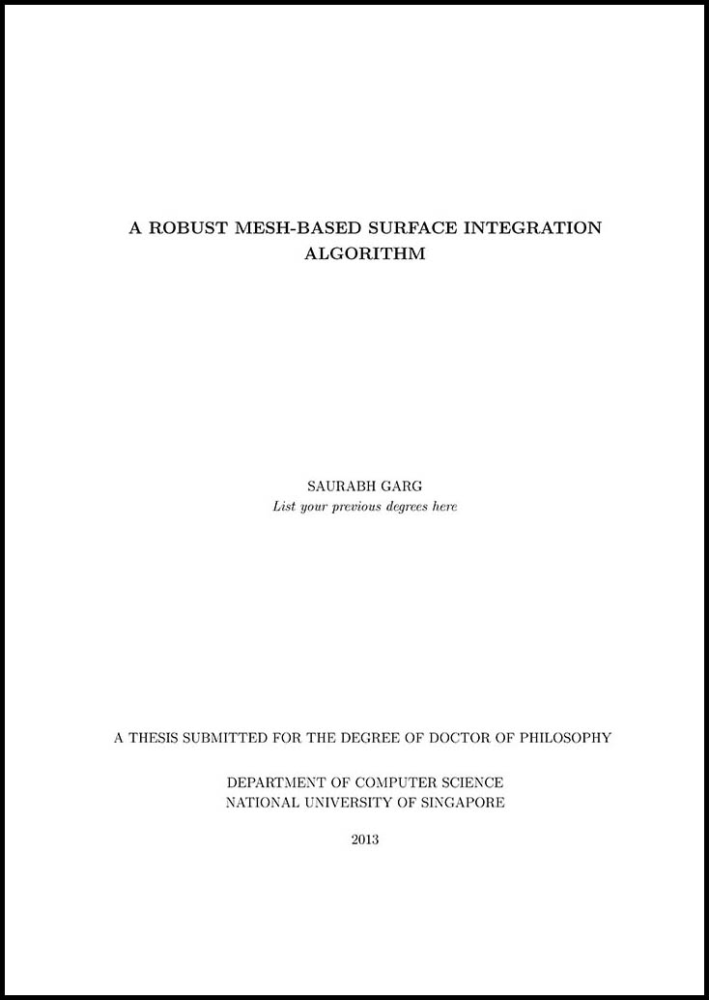
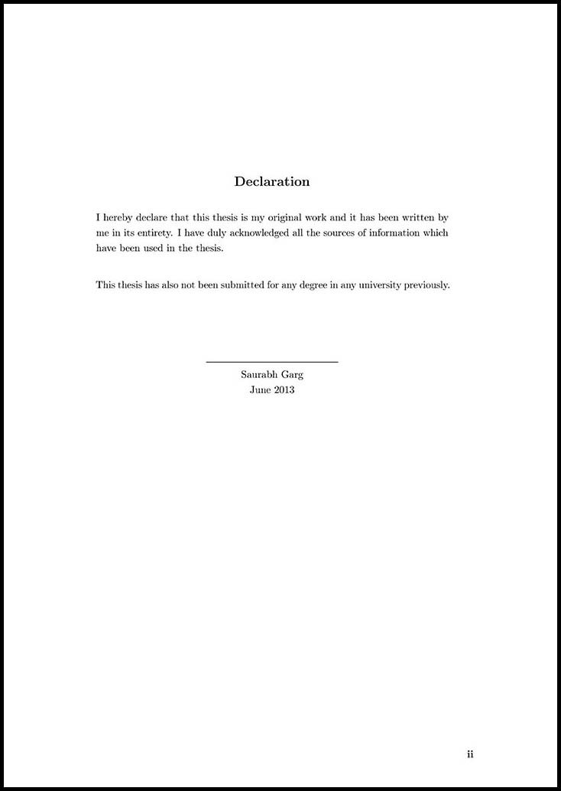
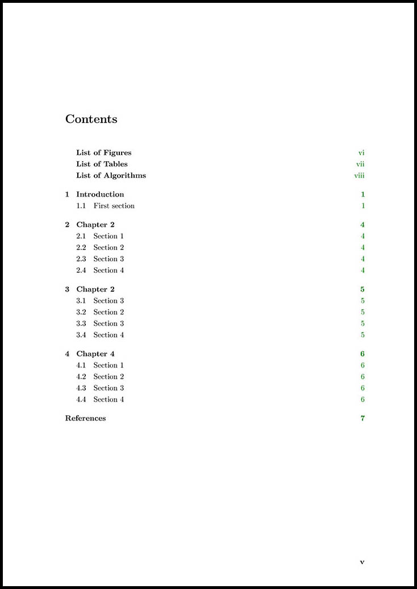
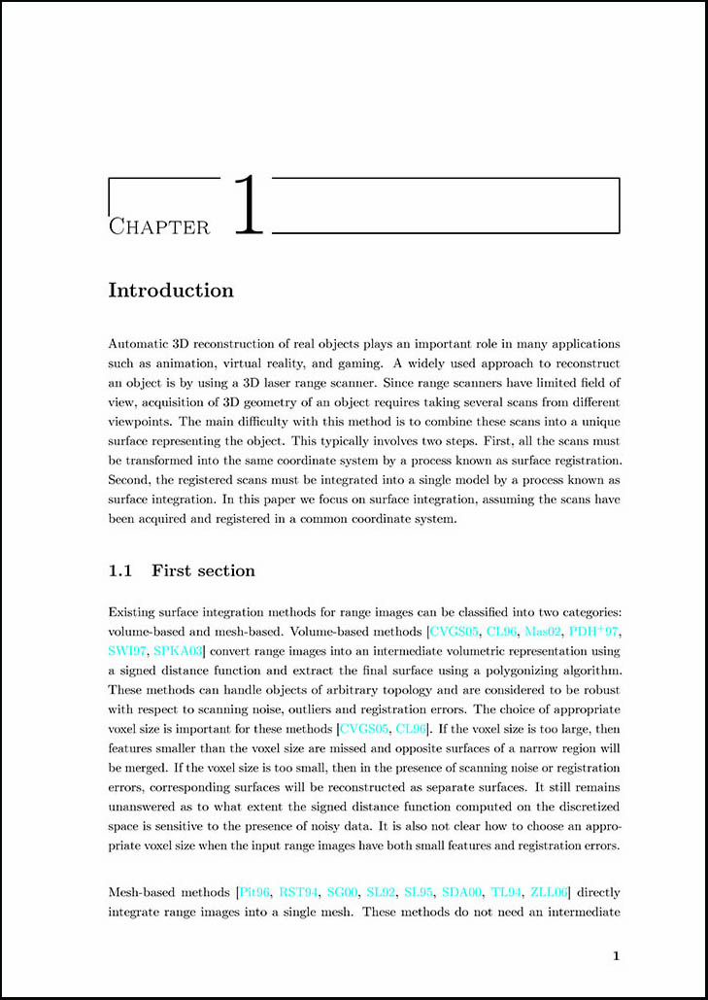
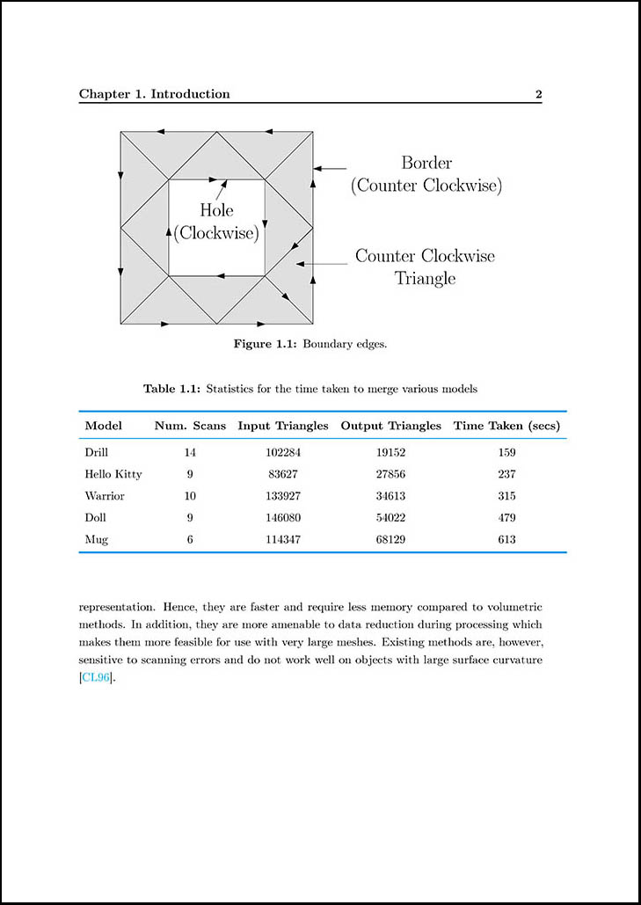
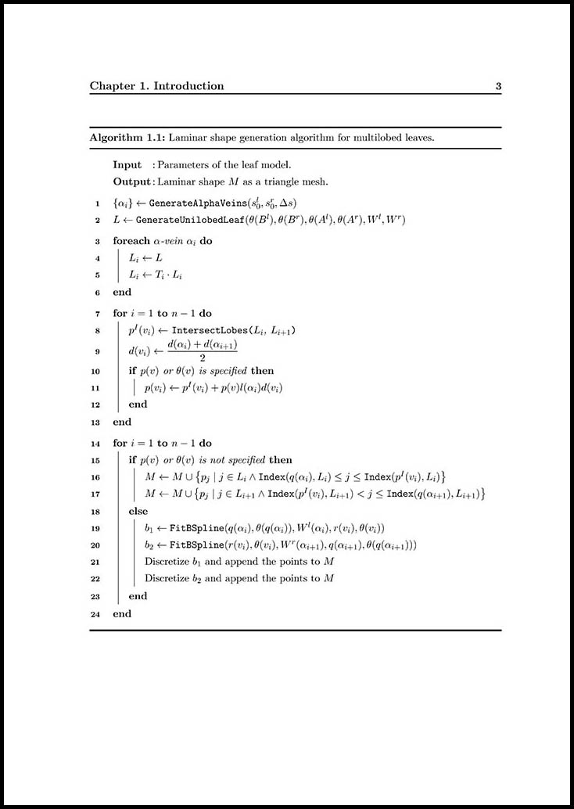

# SPhdThesis #
SPhdThesis is a latex template (document class) for writing PhD thesis. I developed it while writing my PhD thesis in School of Computing (SoC), National University of Singapore (NUS). By default, it adheres to the [NUS Guidelines on Format of Research Thesis Submitted For Examination](http://www.nus.edu.sg/registrar/event/gdthesisexam.html "NUS Guidelines on Format of Research Thesis Submitted For Examination") (Link updated on 31/05/2014). However, it is quite easy to change it for a different guideline.

## Downloading ##
You can download the latest version [here](https://github.com/saurabhg17/SPhdThesis/archive/master.zip "Download SPhdThesis").

## Getting started ##
The easiest way to start using SPhdThesis is to copy the example folder and start by inspecting and modifying `thesis.tex`. `figure.tex`, `table.tex`, `algorithm.tex` files show how to format figures, tables, and algorithms, respectively. `example\thesis.pdf` is an example of how a thesis looks like using SPhdThesis document class.

For more details read `SPhdThesis.pdf`. It describes in detail how to use the document class and provide some hints on how to customize it. It also lists some useful tools for working with latex.

## Getting Help ##
Raise a issue here on GitHub.

## Screenshots ##

<strong>Title Page</strong>

 

<strong>Declaration</strong>

 

<strong>Table of contents</strong>

 

<strong>Chapter title</strong>

 

<strong>Chapter Header and tables</strong>

 

<strong>Algorithms</strong>

